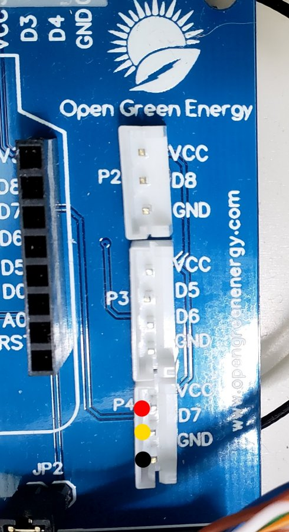

# ESP8266 sketch

<!-- Table of contents can be re-generated by running `npx doctoc README.md` -->
<!-- START doctoc generated TOC please keep comment here to allow auto update -->
<!-- DON'T EDIT THIS SECTION, INSTEAD RE-RUN doctoc TO UPDATE -->

- [Setting up the Arduino IDE](#setting-up-the-arduino-ide)
- [Configuration](#configuration)
- [Test server](#test-server)
- [Connecting the DS18B20](#connecting-the-ds18b20)

<!-- END doctoc generated TOC please keep comment here to allow auto update -->


## Setting up the Arduino IDE

The most common way to get the software compiled and uploaded to the ESP8266 board is to set up the [Arduino IDE](https://www.arduino.cc/en/Main/Software).

- Install the Arduino IDE or if you prefer to use the web-based version, follow the link to create an account
- Under "File" > "Preferences", there is a section that says "Additional Boards Manager URLs". Paste in the URL for the [ESP8266 library](https://github.com/esp8266/Arduino):

```
https://arduino.esp8266.com/stable/package_esp8266com_index.json
```

- Under library manager, install the "Arduino_CRC32", "MAX31850 OneWire" and "MAX31850 DallasTemp" libraries
- Under "Tools" > "Board", select "WeMos D1 R1". This will configure the hardware parameters for you. Otherwise, ensure these values match:
  - Upload Speed: 921600 [bps]
  - CPU Frequency: 80MHz
  - Flash Size: 4MB (FS:2MB OTA:~1019KB)
  - IwIP Variant: v2 Lower Memory
- Plug in your device via USB if you haven't already
- Under "Tools" > "Port", select the port for your ESP8266
  - If the port option is disabled and you are on Windows, ensure you have the correct drivers installed
  - If the port option is disabled on Linux, ensure your user has the correct permissions:
```
# See what group owns the device
ls -lh /dev/ttyUSB0

# You'll see something like "tty", "dialout", or "uucp" for example:
#  crw-rw---- 1 root uucp 188, 0 Jun 24 19:55 /dev/ttyUSB0

# Add your user to that group then reboot your machine
sudo usermod -a -G uucp yourUserName

# If the permission from ls don't match above, modify device access like so:
sudo chmod a+rw /dev/ttyUSB0
```
- The program will still fail to compile until the config file is created (see below)


## Configuration

- Copy config.h.example to config.h and adjust the variables as needed.


## Test server

To verify your weather station is working as expected, you can use the node script included in "index.js".
You will need [node.js](https://nodejs.org/) installed to use it.
To run it, open a terminal within the sketch folder directory and type the command.

```sh
node .
```

If your server is running correctly and the weather station is also configured and running, you will see an output in your terminal like so:

```
server listening 0.0.0.0:3381
[2021-08-19 23:22] 127.0.0.1:52749 - pressure=1002.87,air_temp=25.41,humidity=57.85,altitude=86.80,voltage=3.76,signal=-59,id=053050d3-7fa7-438d-93f1-8285fd5eef79#2142444442
```

This is a raw dump of the message the server receives from the station, which is a plaintext UDP datagram. For more information on how it is constructed and deconstructed, see the [API server's README](../api-server/README.md).


## Connecting the DS18B20

The color coding is important to note. Almost all DS18B20's in a probe configuration are connected with these wire colors:

```
VCC – RED
DATA  - YELLOW
GND - BLACK
```

The DATA pin may not always be yellow but VCC and GND should be red and black, respectively.

You will need to bridge the YELLOW data wire to RED vcc using.


After adding the resistor, the wires should be connected to D7 (Port 4).


